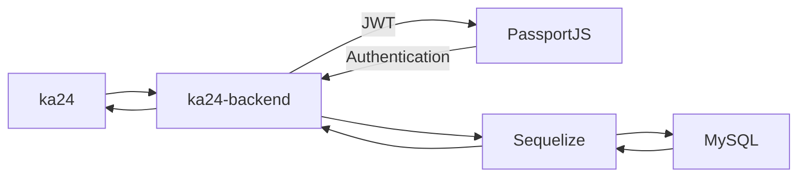

# ka24 - 4 Number Game Solver

## About
This project is for everyone who likes 4 Number Game Solver.You can play and compete with others players in real time!

## Description
this project is like a 24 slover.It has 6 main pages which are `/Login`,`/Home`,`/CreateQuestion`,`/SelectQuestion`,`/play` and `/scoreboard`

## 📦 Built With

#### Front-end

- [Ant Design](https://ant.design/) - A CSS Framework
- [Create React App](https://github.com/facebook/create-react-app) - A Project Creator
- [React](https://reactjs.org/) - A Frontend Library

#### Back-end

 - [JavaScript](https://javascript.info) - A programing language
 - [Sequelize](https://sequelize.org/) - A Backend Library
 - [JWT](https://www.npmjs.com/package/jsonwebtoken) - A Json Web Token
 - [MySQL](https://www.mysql.com/) - A structured query language
 - [NodeJS](https://nodejs.org/en/) -A JavaScript runtime built

## 🛠 Structure

## 📋 Features

- Login and Register system.
- View questions list.
- Create and save questions to questions list.
- Play the game. `[Coming Soon!]`
- Scoreboard. `[Coming Soon!]`
- User managements. `[Coming Soon!]`
- Real-time competition. `[Coming Soon!]`

## 🏷 Version

- Current Version: 0.1.1 `[Coming Soon!]`

- Current Version: 0.1.0

## 💡 Getting Started

1. Clone this project by

    git clone https://github.com/bas3ine/ka24.git

2. Move into project and run this command

    2.1 At Frontend

        npm -i

        npm start

    2.2 At Backend

        npm -i

        nodemon index.js

## More detail...
- [Frontend](/readme/frontend.md)
- [Backend](/readme/backend.md)

## Default link: http://localhost:3000/

